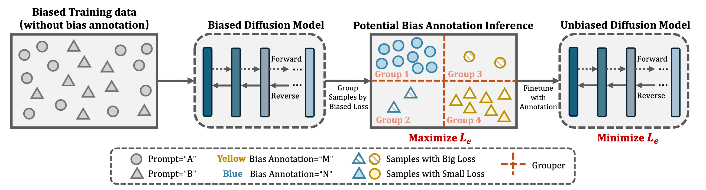

# InvDiff: Invariant Guidance for Bias Mitigation in Diffusion Models

<a href="https://opensource.org/licenses/MIT"></a>

This is the official PyTorch implementation of paper: "InvDiff: Invariant Guidance for Bias Mitigation in Diffusion Models".


In this paper, we focus on addressing the issue of bias in pre-trained diffusion models without the need for additional bias annotations. To solve this challenge, we introduce a framework called InvDiff, which is designed to learn invariant semantic information for guiding diffusion processes. Our approach starts by identifying potential biases within the model through a novel debiasing training objective. We then integrate a lightweight, trainable module that autonomously preserves invariant semantic information, using it to guide the sampling process of the diffusion model towards unbiased outcomes. Figure 1 illustrates the model’s overview.


Figure1. An overview of InvDiff. We first design a novel debiasing objective $\mathcal{L}_e$ for diffusion models. Then we propose a max-min game with the debiasing objective. We first infer potential bias annotations by maximizing the objective. Given the annotations, we finetune the biased model to unbias by minimizing the proposed
## Requirements

```bash
conda create -n invdiff python=3.11
conda activate invdiff
pip install -r requirements.txt
```
To test the environment, you can use this command:
```
import torch
torch.cuda.is_available()
```

## Datasets

We have three datasets, you can use `download.py` to download the datasets from huggingface repo [`Invdiff/Invdiff-Data`](https://huggingface.co/Invdiff/Invdiff-Data/tree/main/invariant). 

```
./data
├── download.py
└── invariant
   └── datasets
      ├── celeba
      ├── fairness
      └── waterbirds
```

## Training of InvDiff
We use the dataset `Fairness` as an example. You can train the InvDiff model with the following command. For other datasets, you can modify the parameters as needed. Our scripts are located in the `./scripts/` directory, and `./scripts/generate.ipynb` contains some code that can generate scripts. If needed, you can use this code to generate scripts.
1. Train the biased model without our method. Before training the unbiased model, you need to get the original model, the model you want to mitigate the bias. You can skip this step if you already have the model. You can train the model using the following command:
   ```bash
   bash scripts/fairness/diff_dataset_no_eiil/run_0_0_sgFalse_t_g2_w3_tgsplit_fairness_32111123.sh
   ```
   You can also find the trained model in the checkpoints directory `./data/invariant/ckpts/dataset_name/`.
2. Train the grouper. You can generate the sample and train the grouper using the following command:
   ```bash
   bash scripts/fairness/grouper/samples/run_split_fairness_32111123_g8_w0.sh

   ```
3. Train the unbiased model. You can train the unbiased model using the following command:
   ```bash
   bash scripts/fairness/diff_dataset_soft/run_0_0.8_sgTrue_t_g8_w0_tgsplit_fairness_32111123_lb1_hgn8.sh
   ```


## Evaluation of InvDiff
1. Train classifier. Because the `Bias` metric requires a classifier, we need to train a classifier first. You can skip this step if you already have the classifier.
You can train the classifier using the following command:
   ```bash
   bash scripts/fairness/classifier/train_classifier_gender2.sh
   bash scripts/fairness/classifier/train_classifier_race4.sh
   ```
   
2. Evaluate the model. We generate the samples and evaluate the model using the following command:   
   ```bash
   bash scripts/fairness/test/diff_dataset/run_0_0.8_sgTrue_t_g8_w0_tgsplit_fairness_32111123_lb1_hgn8.sh
   ```
   You can find the samples in this directory: `./data/invariant/results/{dataset_name}/{model_name}-{ckpt_step}`.
   And you can find the results in this directory: `./data/invariant/results/{dataset_name}/all_results/{model_name}-{ckpt_step}`.

## Checkpoints
The checkpoints should be saved in the `./data/invariant/ckpts/` directory. You can use the `download.py` to download the checkpoints from the huggingface repo [`Invdiff/Invdiff-Data`](https://huggingface.co/Invdiff/Invdiff-Data/tree/main/invariant).

The directory structure of the checkpoints is as follows:
```
./data
├── invariant
│  ├── ckpts
│  │  ├── celeba
│  │  │  ├── models
│  │  │  ├── classifier
│  │  │  └── groupers
│  │  ├── fairness
│  │  │  └── ...
│  │  └── waterbird
│  │     └── ...
```


## Directory Structure
The directory structure of the project is as follows:
```
├── data
│  └── invariant
│     ├── ckpts
│     ├── datasets
│     └── results
├── scripts
│  ├── celeba
│  ├── fairness
│  └── waterbird
├── src
│  ├── group
│  ├── model
│  ├── utils
│  ├── test.py
│  ├── train_classifier.py
│  └── train_text_to_image.py
├── requirements.txt
└── README.md
```


